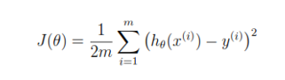

# Univariate Linear Regression

## Problem Statement

Linear Regression is implemented to identify the relationship between profit of a bakery and population of different cities. The main objective is to find the next city in which a new outlet should be opened.

## Methodology

- Implemented the cost function shown in the Fig. below.

- Implemented gradient descent to optimize the cost. No ML frameworks or libraries have been used.

# Directory Structure

<pre>
📦Univariate-Linear-Regression
 ┣ 📂Dataset
 ┃ ┗ 📜ex1data1.txt
 ┣ 📂Documents
 ┃ ┗ 📜Assignment_1 Linear Regression.docx
 ┣ 📜A1_Q1_Part_1.ipynb
 ┗ 📜README.md
 </pre>
